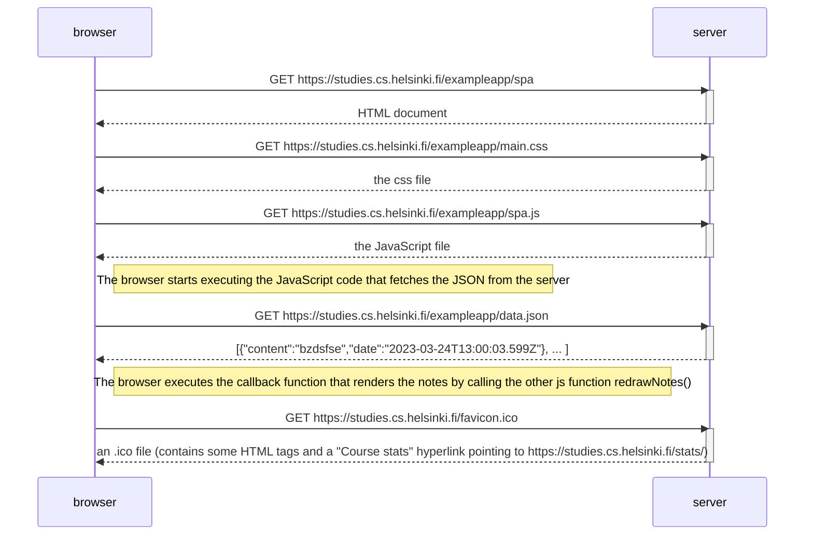

Ex. 0.5 Diagram (very similar to the "traditional/Ajax" display notes diagram - main difference is the larger .js file):

```mermaid
sequenceDiagram
    participant browser
    participant server

    browser->>server: GET https://studies.cs.helsinki.fi/exampleapp/spa
    activate server
    server-->>browser: HTML document
    deactivate server

    browser->>server: GET https://studies.cs.helsinki.fi/exampleapp/main.css
    activate server
    server-->>browser: the css file
    deactivate server

    browser->>server: GET https://studies.cs.helsinki.fi/exampleapp/spa.js
    activate server
    server-->>browser: the JavaScript file
    deactivate server

    Note right of browser: The browser starts executing the JavaScript code that fetches the JSON from the server

    browser->>server: GET https://studies.cs.helsinki.fi/exampleapp/data.json
    activate server
    server-->>browser: [{"content":"bzdsfse","date":"2023-03-24T13:00:03.599Z"}, ... ]
    deactivate server

    Note right of browser: The browser executes the callback function that renders the notes by calling the other js function redrawNotes()
    
    browser->>server: GET https://studies.cs.helsinki.fi/favicon.ico
    activate server
    server-->>browser: an .ico file (contains some HTML tags and a "Course stats" hyperlink pointing to https://studies.cs.helsinki.fi/stats/)
    deactivate server
```

