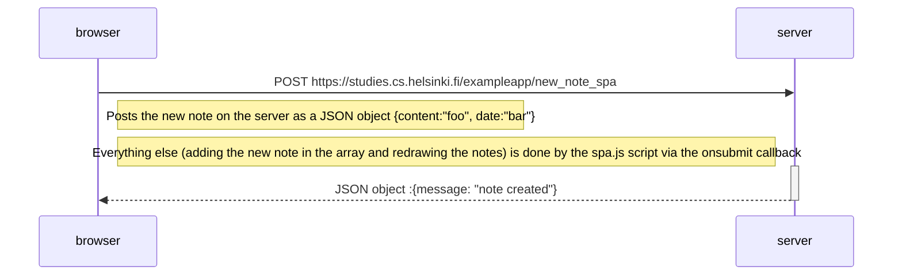

Ex. 0.6 Diagram :

```mermaid
sequenceDiagram
    participant browser
    participant server

    browser->>server: POST https://studies.cs.helsinki.fi/exampleapp/new_note_spa
    Note right of browser: Posts the new note on the server as a JSON object {content:"foo", date:"bar"}
    Note right of browser: Everything else (adding the new note in the array and redrawing the notes) is done by the spa.js script via the onsubmit callback
    activate server
    server-->>browser: JSON object :{message: "note created"}
    deactivate server
```
